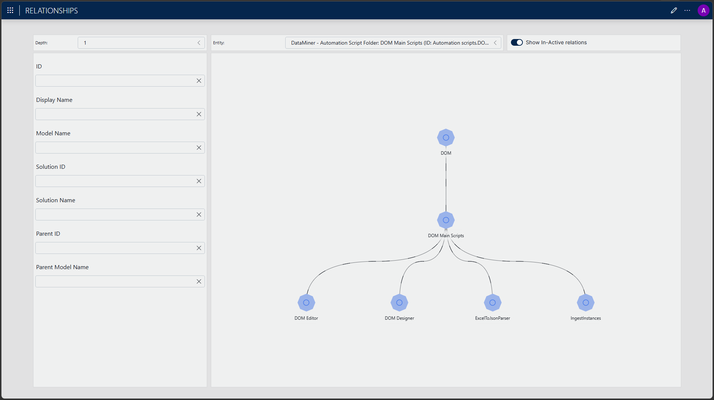

# SLC-S-Relationships

> [!TIP]
> The outcome of this repository is available in the Catalog: [Relationships | Catalog | dataminer.services](https://catalog.dataminer.services/details/06e517f4-5041-41a1-a186-86cdbf0410b9)

When building complex DataMiner systems, objects rarely exist in isolation. Services depend on elements, elements depend on each other, and understanding those connections is key to operating your system effectively.

This solution gives you the tools to establish and manage relationships between objects in DataMiner, allowing you to build a rich network of related objects. Whether you need to track dependencies, model hierarchies, or simply associate related items, the Relationships solution provides a consistent and flexible way to do so.

It comes with:

- A **Standard Data Model** for storing and managing relationships between DataMiner objects.
- A **low-code app** for browsing, creating, and reviewing relationships across your DataMiner System.

## Overview

## Use Cases

A centralized relationship model opens the door to many possibilities, such as:

- **Hierarchy modeling** – Represent parent-child or layered structures between elements, services, or other DataMiner objects.
- **Topology visualization** – Use the stored relationships as input for visual overviews or custom dashboards showing your network topology.
- **Cross-solution integration** – Share a common relationship model across multiple solutions to avoid duplication and ensure consistency.

## Technical Documentation

The technical documentation for the Relationships solution is available in the docs of DevPack: [Technical Documentation](https://github.com/SkylineCommunications/Skyline.DataMiner.Dev.Utils.Solutions.Relationships/tree/1.0.X/docs) folder. It provides detailed information on the architecture, data model, and usage of the solution.