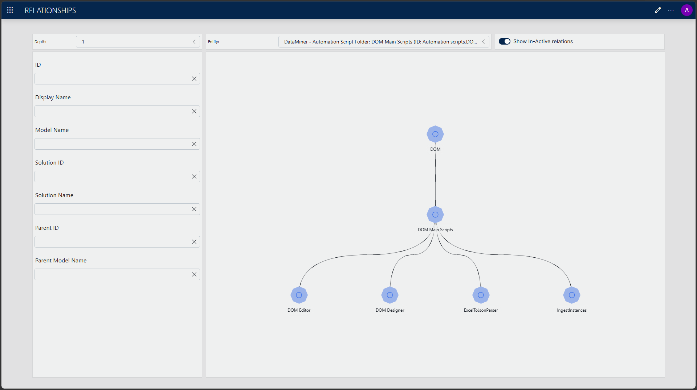

# Relationships

## About

When building complex DataMiner systems, objects rarely exist in isolation. Services depend on elements, elements depend on each other, and understanding those connections is key to operating your system effectively.

This solution gives you the tools to establish and manage relationships between objects in DataMiner, allowing you to build a rich network of related objects. Whether you need to track dependencies, model hierarchies, or simply associate related items, the Relationships solution provides a consistent and flexible way to do so.

## Key Features

- **Manage relationships between DataMiner objects** – Create and maintain a rich network of dependencies, hierarchies, and associations across elements, services, and other objects.
- **Centralized Standard Data Model** – Store relationships in a consistent, reusable model that other solutions can build upon, avoiding duplication across your DataMiner System.
- **Browse and edit via low-code app** – Explore, create, and review relationships through a dedicated low-code application included with the solution.

## Overview

## Use Cases

- **Signal chain dependency tracking** – Model a broadcaster's signal chain from satellite receiver down to IRD and playout encoder. When a device goes down, immediately identify all downstream objects affected.
- **Hierarchy modeling** – Represent parent-child or layered structures between elements, services, or other DataMiner objects to reflect your real operational topology.
- **Cross-solution relationship sharing** – Share a common relationship model across multiple solutions to avoid duplication and ensure consistency throughout your DataMiner System.

## Prerequisites

- DataMiner **10.5.9 Feature Release** or **10.6 Main Release** or higher
